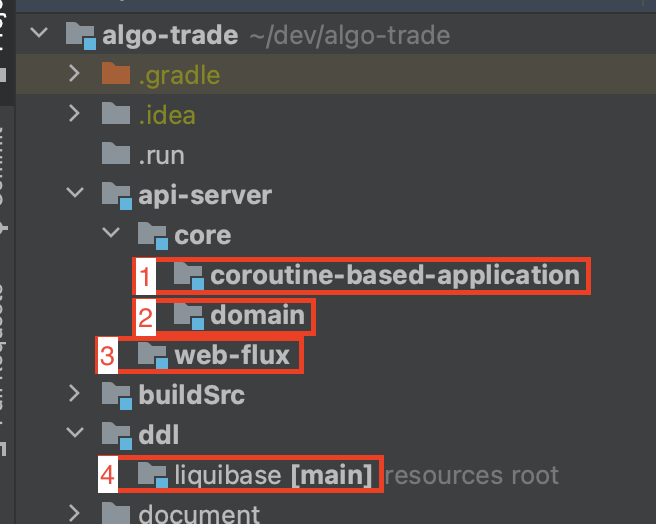
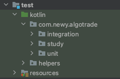
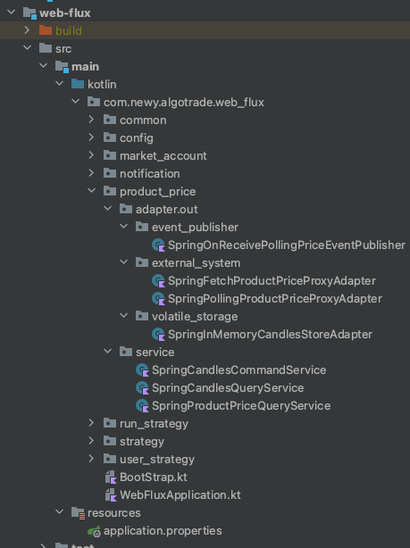

# 프로젝트명

다중 금융상품 알고리즘 투자 알림 봇

# 프로젝트 설명

`가상화폐 거래소`와 `증권사`의 Open API를 사용해서 금융상품 가격을 조회하고, 지표 분석을 통해 주문 시점을 알려주는 프로그램이다.  
현재, 사용할 수 있는 거래소는 `ByBit(가상화폐 거래소)`과 `LS 투자증권(증권사)`이다.

# 프로젝트 요구사항

- Open API를 제공하는 다른 `가상화폐 거래소`와 `증권사`를 추가할 수 있어야 한다
- 라이브러리와 프레임워크를 쉽게 변경할 수 있어야 한다

# 프로젝트 목적

- TDD 훈련
- 핵사고날 아키텍처 실험
- Kotlin 과 SpringBoot WebFlux 학습

# 사용한 기술

- 프로그래밍 언어
    - [Kotlin](https://kotlinlang.org/)
- 프레임워크
    - [Spring Boot WebFlux](https://docs.spring.io/spring-framework/reference/web/webflux.html) (coroutine 기반): 웹 애플리케이션
      조립에 사용
    - [Spring Data R2DBC](https://spring.io/projects/spring-data-r2dbc): 영속성 데이터 접근에 사용
- 라이브러리
    - [OkHttp](https://square.github.io/okhttp/): http 통신, websocket 통신에 사용
    - [jackson](https://github.com/FasterXML/jackson): JSON 데이터 변환에 사용
    - [Jakarta Bean Validation](https://beanvalidation.org/): 입력 유효성 검사에 사용
    - [ta4j](https://github.com/ta4j/ta4j): 캔들 데이터 관리와 지표 생성에 사용
    - [Liquibase](https://www.liquibase.com/): RDB 스키마 관리를 위해 사용
    - [Testcontiners](https://testcontainers.com/): RDB 테스트에 사용

---

# 프로젝트 회고 (배운 점)

## 핵사고날 아키텍처

### 적용한 이유

이 프로젝트는 Spring Boot WebFlux 학습을 위해서 시작했지만, 실제 운영은 다른 프레임워크(Ktor, Android 앱 등)로 구현할 예정이다.  
핵심 비즈니스 로직 재사용 가능성을 확인하기 위해서 핵사고날 아키텍처를 선택했다.

### 용어 정리 (핵사고날 아키텍처 컴포넌트 설명)

해당 문서에서는 아래와 같이 `Bold`처리한 용어를 사용한다

  
이미지 출처: https://tech.kakaobank.com/posts/2311-hexagonal-architecture-in-messaging-hub/

- `인커밍 어댑터` (Driving Adapter)
    - 유스케이스를 호출하는 컴포넌트
    - 외부 요청을 받아서 유스케이스에게 작업을 위임하고, 작업 결과 값을 요청자에게 전달한다
- `아웃고잉 어댑터` (Driven Adapter)
    - 유스케이스가 호출하는 컴포넌트
    - 유스케이스 작업에 필요한 데이터를 조회하거나, 유스케이스가 요청하는 데이터 저장한다
    - 주로, DB 통신, 외부 API 호출같이 외부 프로세스와 통신하는 로직을 구현한다
- Application Core
    - `유스케이스` (Use Case)
        - 계층형 아키텍처에서 Service로 불리는 컴포넌트
        - 인커밍/아웃고잉 어댑터의 데이터를 조합해서, 도메인 객체에 비즈니스 로직 처리를 요청한다
        - 종종, 도메인 객체가 필요하지 않을 수도 있다
    - `도메인 객체` (Entity)
        - 유스케이스가 요청한 비즈니스 로직을 처리한다
    - `Input Port`, `Output Port`
        - 유스케이스가 인커밍/아웃고잉 어댑터와 통신하기 위해 사용하는 Interface 이다

### 장점

#### 인커밍/아웃고잉 어댑터의 대체 가능성에 대한 인식

인커밍/아웃고잉 어댑터에는 의식적으로 비즈니스 로직을 구현하지 않게 된다.  
라이브러리나 프레임워크 변경 시, 어댑터를 재구현해야 하기 때문이다.  
아무리 사소한 비즈니스 로직이라도 `유스케이스`, `도메인 객체`, `Input Port 모델`에 구현하게 되는 습관이 생긴다.

#### 라이브러리, 프레임워크 선택 가능성을 높임

인커밍/아웃고잉 어댑터에 라이브러리와 프레임워크 관련 로직이 있기 때문에  
어댑터만 구현하면 비즈니스 로직에 영향을 주지않고, 라이브러리와 프레임워크를 변경할 수 있다는 자신감이 생긴다.

#### 애플리케이션 경계가 명확해 짐

[용어 정리](#용어-정리-핵사고날-아키텍처-컴포넌트-설명) 에서 설명한 것처럼, 핵사고날 아키텍처의 컴포넌트가 맡는 역할이 명확하다.  
아키텍처에 익숙해진다면, 예상하는 위치에 예상하는 구현 코드가 있기 때문에 로직 찾기가 더 수월해진다.

### 단점

#### 관리해야 할 컴포넌트가 많아진다

인커밍 어댑터(예: Controller), 아웃고잉 어댑터(예: Repository), 유스케이스(예: Service), 도메인 객체는  
다른 아키텍처에서도 자주 사용하는 역할의 컴포넌트여서 큰 불만은 없었다.

고민거리는 Input Port와 Output Port의 존재였다.  
Output Port는 애플리케이션 코드에서 아웃고잉 어댑터으로 향하는 의존성을 역전시켜서, 애플리케이션 코드를 보호하기 때문에 추가할 만한 가치가 있었다.  
Input Port는 적용하지 않을 예정이었지만, 테스트 코드 작성에 도움이 돼서 적용하게 되었다.

## TDD (Test First Development)

### 장점

#### 구체적인 예를 들어 생각하기

어떠한 개념을 설명할 때, 구체적인 예를 들어 설명하면 이해하기 쉬워진다.

테스트를 먼저 작성하면, 시스템이 제공하는 기능에 대한 구체적인 사용 예제를 생각하게 된다.  
대표적인 입력값을 정하고, 해당 사례에 대한 출력값 생성에 집중할 수 있다.

#### 인터페이스 먼저 고민하기

테스트를 먼저 작성하면, 시스템이 제공하는 기능의 사용법(외부 인터페이스)을 먼저 고민하게 된다.  
사용자 코드 입장에서 가장 단순한 사용법과 실행 결과를 확인하는 방법에 집중할 수 있다.

#### 한 번에 하나의 테스트에 집중하기

작업을 하다 보면, 여러 가지 걱정이 생길 때가 있다.  
“이런 입력값은 들어오면 어떻게 처리하지?”, “저런 상태일 때, 호출하면 어떻게 처리해야 할까?”

이런 걱정들은 메모장이나 주석으로 적어놓고, 현재 작업에 집중하는 편이 좋다.  
메모로 작성한 내용은 다음 테스트에서 구체적인 사례로 사용할 수 있다.

#### 일부러 중복코드 만들고 추상화하기

이번 프로젝트를 진행하면서 가장 많이 배운 점이다.  
이전부터 "TDD로 추상화 클래스 계층을 유도하는 방법"에 늘 고민이 있었다.

중복 코드는 언제나 나쁘지만, 중복 코드의 장점은 어느 부분이 중복인지 확실히 알 수 있다는 점이다.  
공통된 로직이 예상되는 기능을 구현할 때, 일단 각각 다른 클래스로 구현하고,  
리팩토링 단계에서 두 클래스의 코드를 조금씩 닮아가도록 유도하면, 공통된(추상화된) 로직을 발견하기가 쉬워진다.

### 생각할 점

#### 정형화된 구현이 예상되는 컴포넌트에 대한 TDD

인커밍/아웃고잉 어댑터는 인터페이스와 구현 코드가 단순하고, 어느 정도 정형화된 구현 패턴이 있다.  
이런 컴포넌트는 TLD(Test Last Development)를 적용해도 큰 문제가 되지 않는 거 같다.

유스케이스는 반반인 거 같다.  
비즈니스 로직이 적은 유스케이스는 TLD가 효과적이고, 비즈니스 로직이 많은 유스케이스는 TDD가 효과적인 거 같다.

## 자동화 테스트

### 장점

#### 리팩토링 안정감

이 프로젝트는 실험 목적이 강해서, 크거나 작은 단위의 리팩토링을 자주 진행했다.  
테스트 코드 덕분에 (알고 있는 케이스에 한해서) 기능이 예상대로 작동한다는 것을 확인할 수 있었고, 리팩토링을 자신 있게 진행할 수 있었다.

#### 학습 테스트

학습 테스트 덕분에 오픈소스(ta4j)에 컨트리뷰션한 경험이 있다. ([Pull Request](https://github.com/ta4j/ta4j/pull/1138))

이번 프로젝트에서 사용한 프로그래밍 언어, 라이브러리, 프레임워크는 모두 처음 사용한 기술들이다.  
프로젝트에서 사용할 프로그래밍 언어와 라이브러리 기능에 대한 사용법을 테스트 코드로 작성하면서 공부했다.  
학습 테스트의 목적은 (1) 프로그래밍 언어와 라이브러리 사용법에 대한 학습과 (2) 버전 업그레이드를 쉽게 하기 위해서이다.

### 생각할 점

#### 세부 구현 사항에 의존하는 테스트

로직의 세부 구현을 확인하는 테스트 코드가 있으면, 리팩토링할 때 테스트 코드도 같이 수정해야 하는 단점이 있다. 예를 들어, 메소드 호출 순서를 확인하는 테스트이다.  
어쩔 수 없는 상황이 아니면, 로직의 세부 구현보다 최종 결괏값을 확인하는 테스트를 작성하는 것이 좋은 거 같다.

#### 테스트 실행 머신 성능에 의존적인 테스트

테스트 실행 환경에 따라 테스트가 종종 실패하는 경우가 있다. 대표적으로 아래와 같은 테스트이다.

- 코루틴 간의 통신을 확인하는 테스트
- mock server와 통신을 확인하는 테스트

실패하는 원인은 테스트 코드에서 `delay` 함수를 사용하기 때문이다.  
`delay` 함수를 사용하지 않고, 통신 여부를 확인하는 flag 같은 걸 도입해서 실험해 볼 예정이다.

---

# 프로젝트 모듈 설명



- `api-server/core/coroutine-based-application`
    - 비동기 로직에 특화된 비즈니스 로직을 구현한 모듈이다
    - Spring WebFlux, Ktor, Android 앱과 같이 코루틴을 지원하는 프로젝트에서 사용하기 위해 분리했다
    - 유스케이스, 코루틴 기반 라이브러리(HTTP 통신, 이벤트 버스 등), 메모리 저장소 등의 구현을 담당한다
- `api-server/core/domain`
    - 동기/비동기 로직에 공통된 비즈니스 로직을 구현한 모듈이다
    - Spring WebMVC 같은 동기 기반 프로젝트에서도 사용하기 위해 분리했다
    - 주가 데이터를 사용한 지표 계산, 주문 진입/진출 알고리즘 계산, JSON 변환 등의 로직을 담당한다
- `api-server/webflux`
    - SpringBoot WebFlux 를 사용한 웹 애플리케이션 모듈이다
    - 웹 애플리케이션 조립과 영속성 어댑터 구현을 담당한다
- `ddl/liquibase`
    - 개발/테스트/운영용 RDB 스키마를 관리하기 위한 모듈이다
    - [Liquibase](https://www.liquibase.com/) 를 사용해서 구현했고, 환경 변수(X_DBMS_NAME)로 `postgresql`과 `mysql`을 선택할 수 있게 구현했다

# 테스트 패키지 설명



- `com.newy.algotrade.integration`
    - 외부 API 통신, RDB 접근 등 외부 프로세스와 통신하는 테스트 코드를 작성한다
- `com.newy.algotrade.study`
    - 프로그래밍 언어와 라이브러리의 사용법에 대한 테스트 코드를 작성한다
    - 프로젝트에서 사용해야 하는 문법과 라이브러리 사용법을 학습한다
    - 프로그래밍 언어와 라이브러리의 버전 업그레이드를 대비한다
- `com.newy.algotrade.unit`
    - 외부 프로세스와 통신이 필요 없는 유닛 테스트 코드를 작성한다
- `helpers`
    - 테스트 프로젝트에서만 사용하는 공통 코드를 작성한다

## 테스트 패키지를 분리한 이유

상황에 맞는 테스트 실행 명령어를 호출하기 위해서, 위와 같이 테스트 패키지 구조를 분리했다.

```bash
# 유닛 테스트 실행 명령어
./gradlew test --tests "com.newy.algotrade.unit.*" --tests "com.newy.algotrade.study.*"

# DB 테스트 실행 명령어
./gradlew api-server:web-flux:test --tests "com.newy.algotrade.integration.*"

# 전체 테스트 실행 명령어
./gradlew test
```

# coroutine-based-application, webflux 모듈 패키지 설명



- `common`: 모듈에서 공통으로 사용하는 코드 구현
- `config`: 스프링 config 코드 선언 (webflux 모듈에서 사용)
- `도메인 이름 패키지` (ex: product_price)
    - `adapter.in`: 인커밍 어댑터 구현
    - `adapter.in.web`: 웹 어댑터 구현
    - `adapter.in.web.model`: 웹 입/출력 모델 구현
    - `adapter.in.internal_system`: 내부 시스템 입력 어댑터 구현 (내부 이벤트 수신, 콜벡 port 구현 로직 등)
    - `adapter.out`: 아웃고잉 어댑터 구현
    - `adapter.out.persistence`: 영속성 어댑터 구현
    - `adapter.out.persistence.repository`: Spring Data R2dbcRepository 관련 로직 구현
    - `adapter.out.volatile_storage`: 메모리 캐시 어댑터 구현
    - `adapter.out.event_publisher`: 이벤트 발행 어댑터 구현
    - `adapter.out.external_system`: 외부 시스템 통신 어댑터 구현
    - `port.in`: Input Port Interface 선언
    - `port.in.model`: Input Port 입력 모델 구현(입력 데이터 유효성 검증 담당)
    - `port.out`: Output Port Interface 선언
    - `service`: 유스케이스 구현

---

# 구현 패턴

## Input/Output Port

Input/Output Port는 메소드를 1개만 선언한 `개별 Port Interface`로 선언하고, 관련있는 `개별 Port Interface`를 상속하는 `대표 Port Interface`를 선언한다.  
`개별 Port Interface`는 SAM Interface로 선언한다.

```kotlin
// 대표 Port Interface
interface MarketAccountPort :
    ExistsMarketAccountPort,
    FindMarketServerPort,
    SaveMarketAccountPort

// 개별 Port Interface
fun interface ExistsMarketAccountPort {
    suspend fun existsMarketAccount(domainEntity: MarketAccount): Boolean
}

// 개별 Port Interface
fun interface FindMarketServerPort {
    suspend fun findMarketServer(market: Market, isProductionServer: Boolean): MarketServer?
}

// 개별 Port Interface
fun interface SaveMarketAccountPort {
    suspend fun saveMarketAccount(domainEntity: MarketAccount): MarketAccount
}
```

### 개별 Port Interface를 사용한 이유

`개별 Port Interface`를 선언하면, 유닛테스트 코드 작성이 편리해진다. 한 번에 하나씩 특정 상황을 시뮬레이션할 수 있기 때문이다.  
또, SAM Interface는 lambda 형식으로 구현할 수 있어서, 테스트 코드가 간결해진다.

```kotlin
@DisplayName("예외 사항 테스트")
class MarketAccountCommandServiceExceptionTest {
    @Test
    fun `중복된 MarketAccount 를 등록하려는 경우`() = runTest {
        val alreadySavedMarketAccountAdapter = ExistsMarketAccountPort { true } // 예외 사항 발생 시뮬레이션
        val service = newMarketAccountCommandService(
            existsMarketAccountPort = alreadySavedMarketAccountAdapter,
        )

        try {
            service.setMarketAccount(incomingPortModel)
            fail()
        } catch (e: DuplicateDataException) {
            assertEquals("이미 등록된 appKey, appSecret 입니다.", e.message)
        }
    }
}

// 테스트 헬퍼 메소드
private fun newMarketAccountCommandService(
    existsMarketAccountPort: ExistsMarketAccountPort = NoErrorMarketAccountAdapter(),
    findMarketServerPort: FindMarketServerPort = NoErrorMarketAccountAdapter(),
    saveMarketAccountPort: SaveMarketAccountPort = NoErrorMarketAccountAdapter(),
) = MarketAccountCommandService(
    existsMarketAccountPort = existsMarketAccountPort,
    findMarketServerPort = findMarketServerPort,
    saveMarketAccountPort = saveMarketAccountPort,
)
```

### 추가 사항

유스케이스에서 `테스트 코드용 생성자`와 `사용자 코드용 생성자`를 따로 제공하면 조금 더 편리하게 사용할 수 있다.

```kotlin
// 유스케이스 구현 코드
open class MarketAccountCommandService(
    // 테스트 코드용 생성자
    private val existsMarketAccountPort: ExistsMarketAccountPort,
    private val findMarketServerPort: FindMarketServerPort,
    private val saveMarketAccountPort: SaveMarketAccountPort
) : MarketAccountUseCase {
    // 사용자 코드용 생성자
    constructor(marketAccountPort: MarketAccountPort) : this(
        existsMarketAccountPort = marketAccountPort,
        findMarketServerPort = marketAccountPort,
        saveMarketAccountPort = marketAccountPort,
    )
    ...
}
```

## 입력 유효성 검증

외부 입력 유효성 검증은 Input Port 입력 모델(`Input Port 패키지`에 위치)에서 처리한다.  
`SelfValidation` 클래스를 상속받고, init 블록에서 `SelfValidation#validate` 메소드를 호출한다.

```kotlin
package market_account.port.`in`.model

// Input Port 입력 모델
data class SetMarketAccountCommand(
    @field:Min(1) val userId: Long,
    val market: Market,
    val isProduction: Boolean,
    @field:NotBlank val displayName: String,
    @field:NotBlank val appKey: String,
    @field:NotBlank val appSecret: String
) : SelfValidating() {
    init {
        validate()
    }
}

open class SelfValidating {
    companion object {
        private val VALIDATOR = Validation.buildDefaultValidatorFactory().validator
    }

    protected fun validate() {
        val violations = VALIDATOR.validate(this)
        if (violations.isNotEmpty()) {
            throw ConstraintViolationException(violations)
        }
    }
}
```

---

# 코딩 컨벤션

## Input Port

### 인터페이스 이름

데이터 변경하는 Input Port 는 접미사 `UseCase`를 사용하고, 그 외는 접미사 `Query`를 사용한다.

```kotlin
// 데이터를 변경 가능 Port
interface CandlesUseCase :
    SetCandlesUseCase,
    AddCandlesUseCase,
    RemoveCandlesUseCase

// 데이터 조회 전용 Port
interface CandlesQuery :
    GetCandlesQuery
```

### 입력 모델 이름

접미사 `Command`를 사용한다. SelfValidating을 상속받아서, 입력 데이터 유횻값을 검증한다.

```kotlin
data class SetMarketAccountCommand(...) : SelfValidating() {
    init {
        validate()
    }
}
```

## 유스케이스

### 클래스 이름

- `coroutine-based-application 모듈`: Input Port 이름(UseCase 는 Command 로 변경) + 접미사 `Service`를 사용한다.

    ```kotlin
    // UseCase Port 를 구현하는 경우 (UseCase를 Command로 변경해서 사용한다)
    class MarketAccountCommandService : MarketAccountUseCase {
        ...
    }
  
    // Query Port 를 구현하는 경우
    open class StrategyQueryService : StrategyQuery {
        ...
    }
    ```

- `web-flux 모듈`: 접두사 `Spring` + 유스케이스 이름을 사용한다.

    ```kotlin
    @Service
    @Transactional
    open class SpringMarketAccountCommandService(...) : MarketAccountCommandService(marketAccountPort) {
        ...
    }
    ```

### @Transactional 애노테이션

`web-flux 모듈`에서 영속성 어댑터를 사용하는 유스케이스에 `@Transactional` 애노테이션을 추가한다.  
읽기 전용 유스케이스는 `read-only` 속성값을 `true`로 설정한다.

```kotlin
// 영속성 데이터 변경 유스케이스
@Service
@Transactional
open class SpringMarketAccountCommandService(
    marketAccountPort: MarketAccountPort,
) : MarketAccountCommandService(marketAccountPort)

// 읽기 전용 유스케이스
@Service
@Transactional(readOnly = true)
open class SpringStrategyQueryService(
    strategyPort: StrategyPort
) : StrategyQueryService(strategyPort)
```

## Output Port

### 인터페이스 이름

접미사 `Port`를 사용한다. `개별 Port Interface`의 이름은 아래에서 설명하는 [메소드 이름](#메소드-이름)를 참고해서 짓는다.

```kotlin
interface MarketAccountPort :
    ExistsMarketAccountPort,
    FindMarketServerPort,
    SaveMarketAccountPort
```

### 메소드 이름

메소드 이름은 아웃고잉 어댑터에서 사용하는 라이브러리의 메소드 이름과 비슷하게 짓는다.  
영속성 어댑터는 `findXxx`, `deleteXxx`, `saveXxx`, `existsXxx` 같은 이름을 사용하고,  
HTTP API 통신 어댑터는 `fetchXxx` 같은 이름을 사용한다.

```kotlin
// 영속성 데이터 Port
fun interface ExistsMarketAccountPort {
    suspend fun existsMarketAccount(domainEntity: MarketAccount): Boolean
}

// 외부 HTTP API 통신 Port
fun interface FetchProductPricesPort {
    suspend fun fetchProductPrices(param: GetProductPriceHttpParam): List<ProductPrice>
}
```

#### 메소드 이름 짓는 규칙을 정한 이유

`Input Port 의 메소드 이름`과 `Output Port 의 메소드 이름`이 같아지는 현상을 방지하기 위해서,  
Output Port 메소드 이름을 짓는 패턴을 변경했다.

```kotlin
// AS-IS
open class StrategyQueryService(
    private val strategyPort: HasStrategyPort
) : StrategyQuery {
    // Input Port 메소드 이름: hasStrategy 
    override suspend fun hasStrategy(className: String): Boolean =
        // Output Port 메소드 이름: hasStrategy
        strategyPort.hasStrategy(className)
}

// TO-BE
open class StrategyQueryService(
    private val strategyPort: ExistsStrategyPort
) : StrategyQuery {
    // Input Port 메소드 이름: hasStrategy
    override suspend fun hasStrategy(className: String): Boolean =
        // Output Port 메소드 이름: existsStrategy
        strategyPort.existsStrategy(className)
}
```

## 아웃고잉 어댑터

### 클래스 이름

- 영속성 어댑터: 접미사 `PersistenceAdapter`
- 이벤트 발행 어댑터: 접미사 `EventPublisher`
- 인메모리 저장소 어댑터: 접미사 `StoreAdapter`

```kotlin
// 영속성 어댑터
class MarketAccountPersistenceAdapter : MarketAccountPort {
    ...
}

// 이벤트 발행 어댑터
open class OnReceivePollingPriceEventPublisher : OnReceivePollingPricePort {
    ...
}

// 인메모리 저장소 어댑터
class InMemoryCandlesStoreAdapter : CandlesPort {
    ...
}
```

---

# 프로젝트 실행 명령어

## 테스트 실행 명령어

### 유닛 테스트 실행

```bash
./gradlew test --tests "com.newy.algotrade.unit.*" --tests "com.newy.algotrade.study.*"
```

### DB 테스트 실행

```bash
# DB 테스트 실행 템플릿
./gradlew api-server:web-flux:test --tests "com.newy.algotrade.integration.*" -DX_DBMS_NAME={postgresql | mysql}

# 예시: PostgreSQL 기반 DB 테스트 실행
./gradlew api-server:web-flux:test --tests "com.newy.algotrade.integration.*" -DX_DBMS_NAME=postgresql

# 예시: MySQL 기반 DB 테스트 실행
./gradlew api-server:web-flux:test --tests "com.newy.algotrade.integration.*" -DX_DBMS_NAME=mysql
```

### 통합 테스트 실행 (ByBit, LS증권의 Open API Key 를 발급 받지 않은 경우 )

```bash
```bash
# 통합 실행 템플릿
./gradlew test -DX_DBMS_NAME={postgresql | mysql}

# 예시: PostgreSQL 기반 통합 테스트 실행
./gradlew test -DX_DBMS_NAME=postgresql

# 예시: MySQL 기반 통합 테스트 실행
./gradlew test -DX_DBMS_NAME=mysql
```

### 통합 테스트 실행 (ByBit, LS증권의 Open API Key 를 발급 받은 경우 )

```bash
# 통합 실행 템플릿
./gradlew test \
-DX_DBMS_NAME={postgresql | mysql} \
-DX_BY_BIT_API_KEY={ByBit API SECRET} \
-DX_BY_BIT_API_SECRET={ByBit API SECRET} \
-DX_LS_SEC_API_KEY={LS 증권 API KEY} \
-DX_LS_SEC_API_SECRET={LS 증권 API SECRET}

# 예시: PostgreSQL 기반 통합 테스트 실행
./gradlew test \
-DX_DBMS_NAME=postgresql \
-DX_BY_BIT_API_KEY={ByBit API SECRET} \
-DX_BY_BIT_API_SECRET={ByBit API SECRET} \
-DX_LS_SEC_API_KEY={LS 증권 API KEY} \
-DX_LS_SEC_API_SECRET={LS 증권 API SECRET}

# 예시: MySQL 기반 통합 테스트 실행
./gradlew test \
-DX_DBMS_NAME=mysql \
-DX_BY_BIT_API_KEY={ByBit API SECRET} \
-DX_BY_BIT_API_SECRET={ByBit API SECRET} \
-DX_LS_SEC_API_KEY={LS 증권 API KEY} \
-DX_LS_SEC_API_SECRET={LS 증권 API SECRET}
```

## RDB 스키마 생성, 삭제 명령어

### 스키마 생성

```bash
# DB 스키마 생성 커맨드 템플릿
./gradlew :ddl:liquibase:update \
-DX_DBMS_NAME={postgresql | mysql} \
-DX_MYSQL_JDBC_URL={MySQL JDBC URL} \
-DX_MYSQL_USERNAME={MySQL username} \
-DX_MYSQL_PASSWORD={MySQL password} \
-DX_POSTGRESQL_JDBC_URL={PostgreSQL JDBC URL} \
-DX_POSTGRESQL_USERNAME={PostgreSQL username} \
-DX_POSTGRESQL_PASSWORD={PostgreSQL password} \
-DX_LS_SEC_API_KEY={LS 증권 API KEY} \
-DX_LS_SEC_API_SECRET={LS 증권 API SECRET}

# 예시: PostgreSQL DB 스키마 생성
./gradlew :ddl:liquibase:update \
-DX_DBMS_NAME=postgresql \
-DX_POSTGRESQL_JDBC_URL=jdbc:postgresql://localhost:5432/ \
-DX_POSTGRESQL_PASSWORD=root \
-DX_POSTGRESQL_USERNAME=postgres \
-DX_LS_SEC_API_KEY={LS 증권 API KEY} \
-DX_LS_SEC_API_SECRET={LS 증권 API SECRET}

# 예시: MySQL DB 스키마 생성
./gradlew :ddl:liquibase:update \
-DX_DBMS_NAME=mysql \
-DX_MYSQL_JDBC_URL=jdbc:mysql://localhost:3306 \
-DX_MYSQL_PASSWORD=root \
-DX_MYSQL_USERNAME=root \
-DX_LS_SEC_API_KEY={LS 증권 API KEY} \
-DX_LS_SEC_API_SECRET={LS 증권 API SECRET}
```

### 스키마 삭제

```bash
# DB 스키마 생성 커맨드 템플릿
./gradlew :ddl:liquibase:dropAll \
-DX_DBMS_NAME={postgresql | mysql} \
-DX_MYSQL_JDBC_URL={MySQL JDBC URL} \
-DX_MYSQL_USERNAME={MySQL username} \
-DX_MYSQL_PASSWORD={MySQL password} \
-DX_POSTGRESQL_JDBC_URL={PostgreSQL JDBC URL} \
-DX_POSTGRESQL_USERNAME={PostgreSQL username} \
-DX_POSTGRESQL_PASSWORD={PostgreSQL password}

# 예시: PostgreSQL DB 스키마 삭제
./gradlew :ddl:liquibase:dropAll \
-DX_DBMS_NAME=postgresql \
-DX_POSTGRESQL_JDBC_URL=jdbc:postgresql://localhost:5432/ \
-DX_POSTGRESQL_PASSWORD=root \
-DX_POSTGRESQL_USERNAME=postgres

# 예시: MySQL DB 스키마 삭제
./gradlew :ddl:liquibase:dropAll \
-DX_DBMS_NAME=mysql \
-DX_MYSQL_JDBC_URL=jdbc:mysql://localhost:3306 \
-DX_MYSQL_PASSWORD=root \
-DX_MYSQL_USERNAME=root
```

---

# 개발환경 설정 & 실행 방법

```
작성 예정
```

---

# 다이어그램

## ERD


## 클래스 다이어그램

### 캔들 차트 지표 계산 도메인


### 그 외 클래스 다이어그램

```kotlin
작성 예정
```